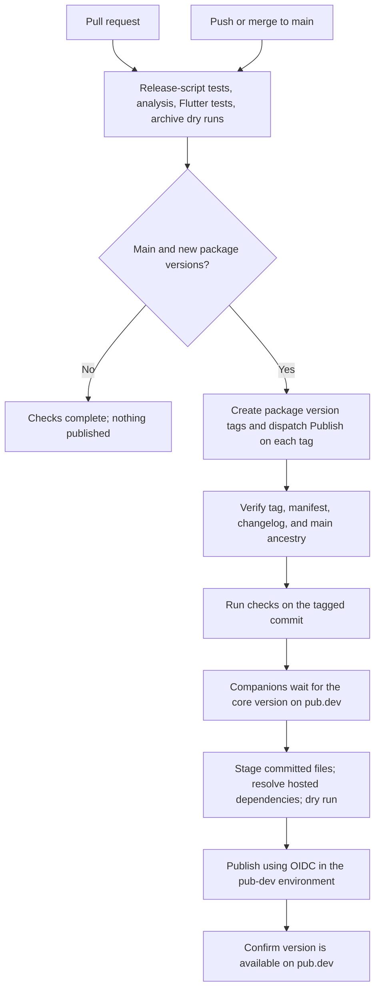

# Automated releases: main to pub.dev

The workflows are in this repository. You need to configure the pub.dev
trust settings and GitHub environment below once. After that, merging a
version bump into `main` is sufficient to publish it.

Versions are deliberate: automation reads `pubspec.yaml`; it does not invent
versions or publish every commit. Already-published versions are skipped.
This pipeline accepts stable `major.minor.patch` versions.

## 1. Enable trusted publishing for each package

Sign in to pub.dev with the Google account that owns the packages. Open each
package's **Admin** tab and find **Automated publishing** / **Publishing from
GitHub Actions**:

| Admin page | GitHub repository | Tag pattern |
| --- | --- | --- |
| [tomeui](https://pub.dev/packages/tomeui/admin) | `artificery-dev/tomeui` | `tomeui-v{{version}}` |
| [tomeui_desktop](https://pub.dev/packages/tomeui_desktop/admin) | `artificery-dev/tomeui` | `tomeui_desktop-v{{version}}` |
| [tomeui_clickwheel](https://pub.dev/packages/tomeui_clickwheel/admin) | `artificery-dev/tomeui` | `tomeui_clickwheel-v{{version}}` |

For **all three packages**:

1. Enable publishing from GitHub Actions.
2. Enter the repository and tag pattern from the table. Keep `{{version}}`
   literally in the pattern; do not replace it with `0.1.0`.
3. Allow both **push** and **workflow_dispatch** events. Dispatch is essential:
   the main workflow creates a tag and explicitly starts publishing on it.
4. Require a GitHub deployment environment, named exactly **`pub-dev`**.
5. Save the settings.

Do not upload your local pub credentials to GitHub or add a pub.dev token as
a repository secret. The publishing job obtains a short-lived GitHub OIDC
credential through `dart-lang/setup-dart`.

## 2. Create the GitHub deployment environment

Open [repository environments](https://github.com/artificery-dev/tomeui/settings/environments)
and create an environment named **`pub-dev`**.

- Leave **required reviewers** and **wait timers** off for fully automatic releases.
- Under deployment branches and tags, choose **Selected branches and tags**.
- Add three **tag** rules: `tomeui-v*`, `tomeui_desktop-v*`, and
  `tomeui_clickwheel-v*`.
- No environment secrets are needed.

The environment name must match pub.dev and `publish.yml`. The workflow also
checks that each tag points to a commit in `main` and that the tag's version
matches the selected package's manifest and changelog.

## 3. Check GitHub Actions settings

Open [Actions settings](https://github.com/artificery-dev/tomeui/settings/actions).
GitHub Actions must be enabled. If your organization restricts actions, allow:

- `actions/checkout`
- `subosito/flutter-action`
- `extractions/setup-just` and its `extractions/setup-crate` dependency
- `dart-lang/setup-dart`
- `actions/cache`, used by the Flutter setup action

The workflows declare the permissions they need:

| Job | Permissions |
| --- | --- |
| Pull-request and release checks | `contents: read` |
| Main's tag-and-dispatch job | `contents: write`, `actions: write` |
| Pub.dev publishing job | `contents: read`, `id-token: write` |

An organization policy must not block those explicitly requested permissions.
There is no need to make the repository's default workflow token writable,
create a personal access token, or allow Actions to approve pull requests.

For branch protection, add a ruleset for `main` requiring pull requests and
the CI check named **Analyze, test, and validate packages** (GitHub may display
its reusable-workflow prefix, `checks /`). Select the check after its first
run so you use the exact name GitHub reports. This protects merging; publishing
is gated by the same checks even without a branch rule.

## 4. Make a release

For each package you intend to release, edit its version and add release notes:

| Package | Version file | Release notes |
| --- | --- | --- |
| `tomeui` | `pubspec.yaml` | `CHANGELOG.md` |
| `tomeui_desktop` | `desktop/pubspec.yaml` | `desktop/CHANGELOG.md` |
| `tomeui_clickwheel` | `clickwheel/pubspec.yaml` | `clickwheel/CHANGELOG.md` |

For example, change `version: 0.1.0` to `version: 0.1.1`, and add a
`## 0.1.1` changelog section describing the changes. Packages can have different
versions; an unchanged companion package does not need a release.

If a companion starts using APIs introduced in a newer `tomeui`, increase its
`tomeui` dependency lower bound to that version too. For example:

```yaml
dependencies:
  tomeui: ^0.1.1
```

Keep the playground's local workspace constraint compatible with the root
version. The playground itself always retains `publish_to: none`.

Run `just check`, commit the changes, and merge the pull request into `main`.
You do not need to create tags or run `just publish` for the normal CI path.

## What runs automatically



Validation uses Flutter **3.44.9**, Dart **3.12.2**, and just **1.58.0**.
The Flutter suites cover the toolkit, clickwheel, and playground. The Python
tests cover version selection, tag collisions, dispatch, staging, and retries.

Publication uses a temporary copy of the tagged commit. Workspace overrides
are disabled there, so a companion must resolve the root package from pub.dev
before it can upload. The root ignore rules do not hide child package files.
Neither the playground nor CI tooling is published as a package.

Tag dispatches can run concurrently, but companion uploads wait for the root
version from their tagged checkout. A repeated tag workflow skips a version
that is already published. Tags are immutable: automation never force-moves one.

## First verification

1. Complete the pub.dev and environment settings above.
2. Open [GitHub Actions](https://github.com/artificery-dev/tomeui/actions).
3. The first CI run with all versions still at `0.1.0` should pass and report
   that there are no releases needed. This validates CI without creating a release.
4. Merge the next real package version bump. Watch **CI**, followed by a
   **Publish** run for each new version tag.
5. Confirm the new version appears on its pub.dev package page.

## Recovery

- **CI fails:** fix the reported analysis, test, or packaging problem. No release
  tags are created until checks pass.
- **Pub.dev rejects OIDC:** check the exact repository, tag pattern, allowed
  `workflow_dispatch` event, and `pub-dev` environment name for that package.
  Save corrected settings, then rerun the failed Publish jobs.
- **GitHub refuses tag creation or dispatch:** inspect Actions permissions and
  repository/organization rules that restrict tag creation. The tag-and-dispatch
  job needs its declared `contents: write` and `actions: write` permissions.
- **A companion times out waiting for the root:** fix or rerun the root Publish
  job first, then rerun the companion. Each availability wait is bounded to ten minutes.
- **Tag creation succeeded but dispatch failed:** rerun that main CI job while
  it remains the current main commit, or run **Publish → Run workflow** and
  select the existing version **tag**. Dispatching Publish on `main` is rejected.
- **A tag points to a different commit:** rerun publishing on that existing tag
  if its contents are correct. If the release contents need changes, commit a
  new version bump. Do not move a release tag or reuse a published version.

For a manual fallback, `just publish <package> --force` still works with your
local pub.dev login. It does not configure or exercise GitHub OIDC.

## Files to maintain

- `.github/workflows/ci.yml`: PR/main checks, version tags, and dispatch.
- `.github/workflows/checks.yml`: shared quality gates.
- `.github/workflows/publish.yml`: tag validation and OIDC publishing.
- `.github/actions/setup/action.yml`: pinned Flutter and just versions.
- `tool/release.py` and `tool/release_test.py`: release logic and tests.

If you upgrade Flutter, update the setup action and keep the Dart version in
the publishing job aligned with that Flutter SDK. If the repository or
environment name changes, update both the workflows/tooling and pub.dev settings.

References: [Dart automated publishing](https://dart.dev/tools/pub/automated-publishing),
[pub.dev's workflow_dispatch support](https://github.com/dart-lang/pub-dev/issues/8507),
and [GitHub workflow triggering](https://docs.github.com/en/actions/how-tos/write-workflows/choose-when-workflows-run/trigger-a-workflow).
